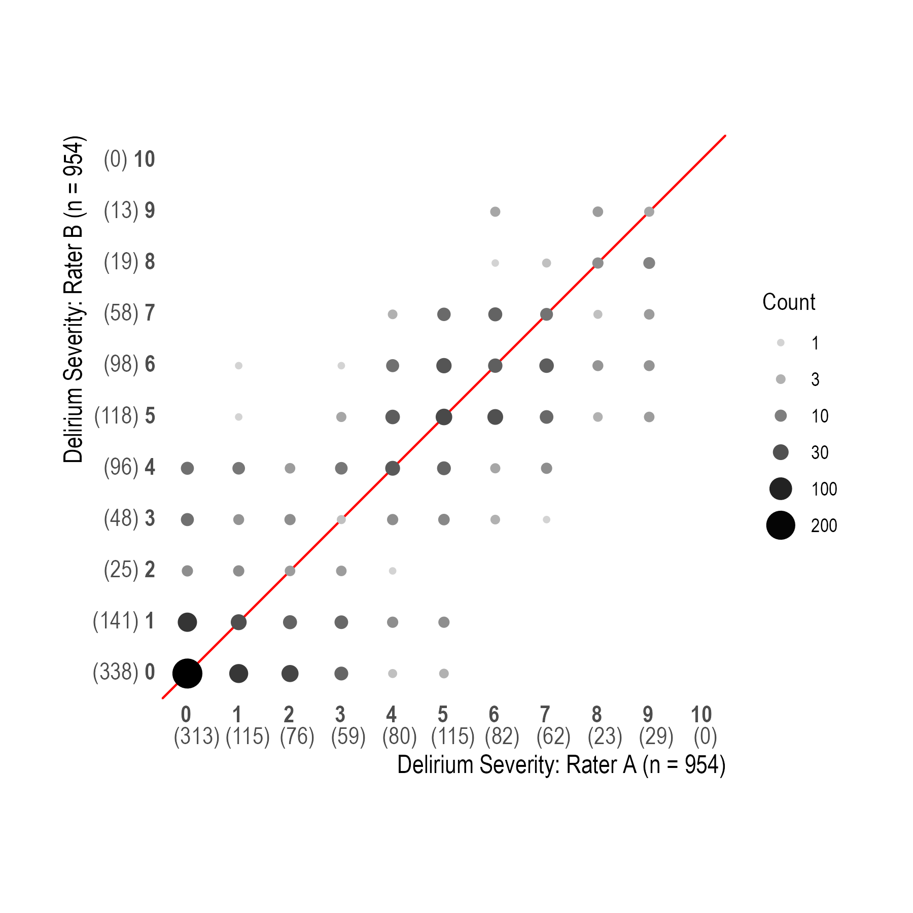
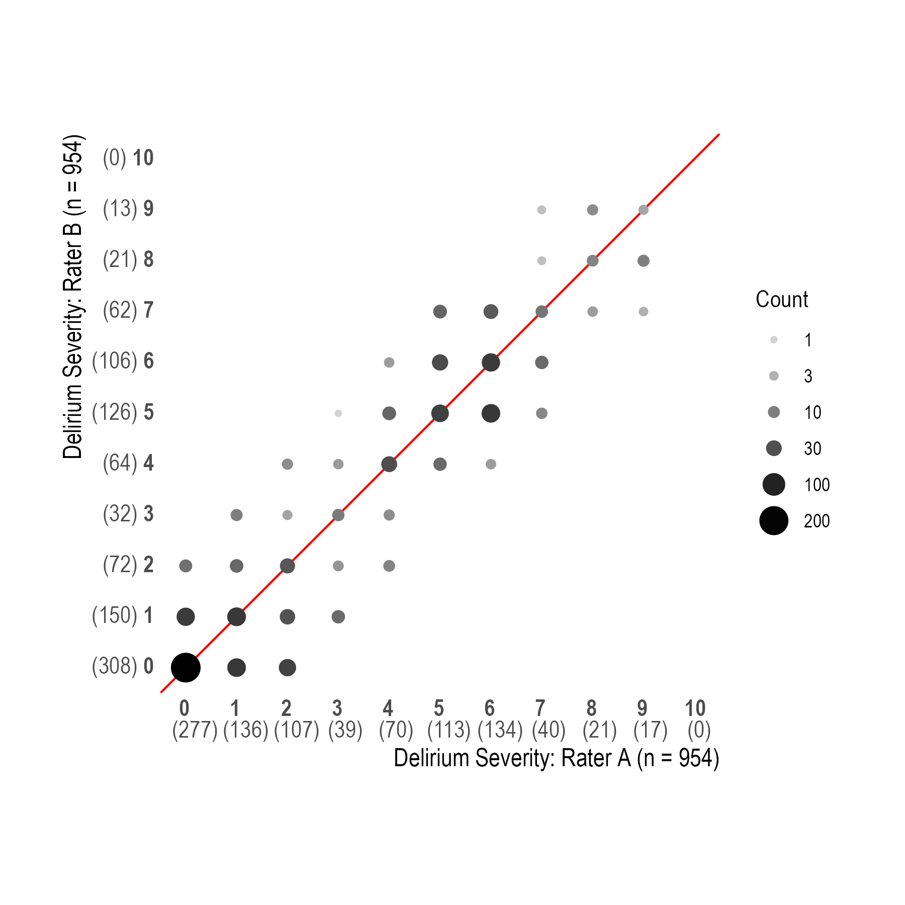
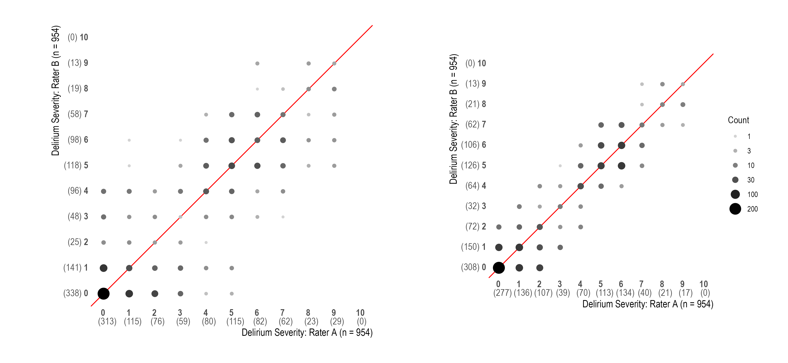
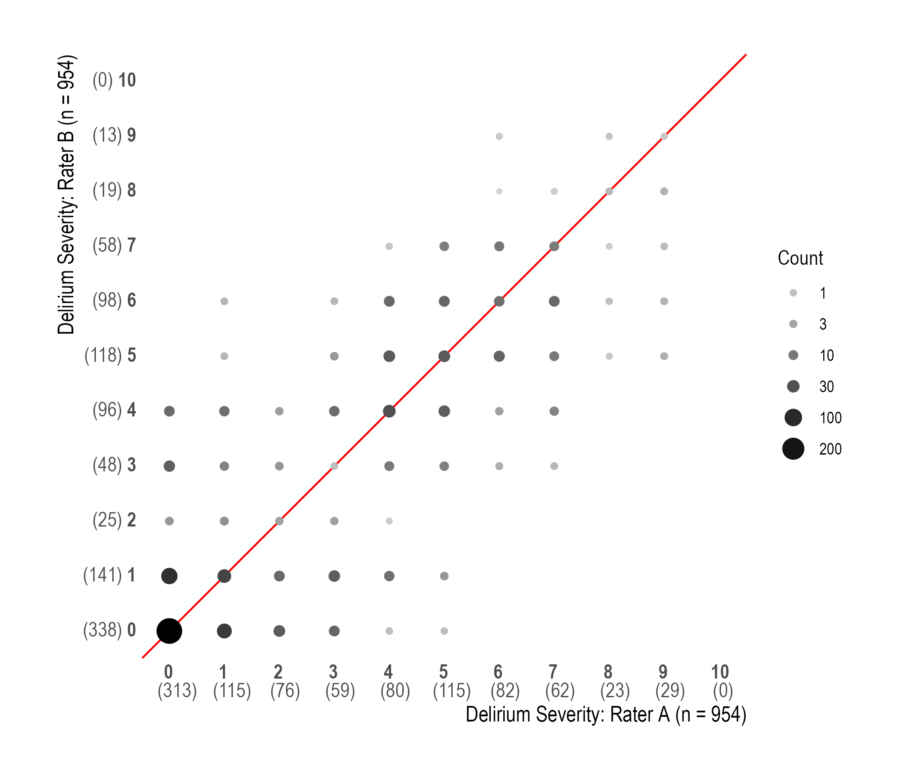
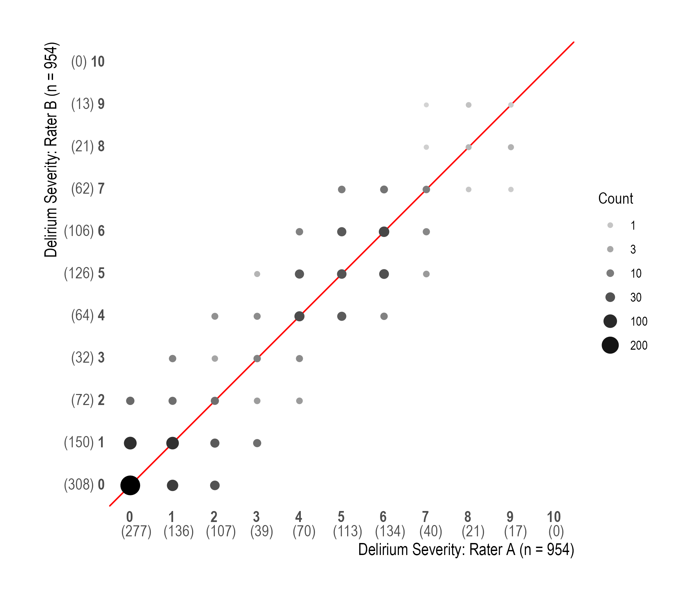
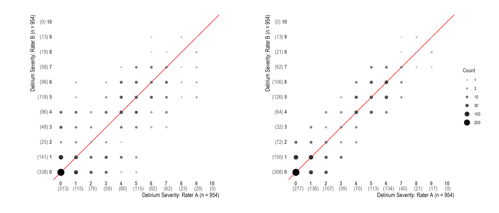

```{r}

a1 <- readRDS(here::here("RData", "050-all_pairs_df_initial.rds"))
a2 <- readRDS(here::here("RData", "050-all_pairs_df_consensus.rds"))
```

# Rater agreement

```{r}
#| label: correlation
# Compute and format correlation coefficient
corr_delirium_severity_initial <- cor(a1$delirium_severity_A, a1$delirium_severity_B, use = "complete.obs")
corr_delirium_severity_initial <- formatC(corr_delirium_severity_initial, digits = 2)
corr_delirium_severity_consensus <- cor(a2$delirium_severity_A, a2$delirium_severity_B, use = "complete.obs")
corr_delirium_severity_consensus <- formatC(corr_delirium_severity_consensus, digits = 2)

corr_delirium_presence_initial <- cor(a1$delirium_presence_A, a1$delirium_presence_B, use = "complete.obs")
corr_delirium_presence_initial <- formatC(corr_delirium_presence_initial, digits = 2)
corr_delirium_presence_consensus <- cor(a2$delirium_presence_A, a2$delirium_presence_B, use = "complete.obs")
corr_delirium_presence_consensus <- formatC(corr_delirium_presence_consensus, digits = 2)

corr_dementia_severity_initial <- cor(a1$dementia_severity_A, a1$dementia_severity_B, use = "complete.obs")
corr_dementia_severity_initial <- formatC(corr_dementia_severity_initial, digits = 2)
corr_dementia_severity_consensus <- cor(a2$dementia_severity_A, a2$dementia_severity_B, use = "complete.obs")
corr_dementia_severity_consensus <- formatC(corr_dementia_severity_consensus, digits = 2)

corr_ncd_presence_initial <- cor(a1$ncd_presence_A, a1$ncd_presence_B, use = "complete.obs")
corr_ncd_presence_initial <- formatC(corr_ncd_presence_initial, digits = 2)
corr_ncd_presence_consensus <- cor(a2$ncd_presence_A, a2$ncd_presence_B, use = "complete.obs")
corr_ncd_presence_consensus <- formatC(corr_ncd_presence_consensus, digits = 2)
```

```{r}
#| label: correlation-weighted
# Compute and format weighted correlation coefficient
corr_delirium_severity_initial_wt <- cov.wt(a1 %>% select(delirium_severity_A, delirium_severity_B), wt=a1$wt, cor=TRUE)[["cor"]][2,1]
corr_delirium_severity_initial_wt <- formatC(corr_delirium_severity_initial_wt, digits = 2)
corr_delirium_severity_consensus_wt <- cov.wt(a2 %>% select(delirium_severity_A, delirium_severity_B), wt=a2$wt, cor=TRUE)[["cor"]][2,1] 
corr_delirium_severity_consensus_wt <- formatC(corr_delirium_severity_consensus_wt, digits = 2)

corr_delirium_presence_initial_wt <- cov.wt(a1 %>% select(delirium_presence_A, delirium_presence_B), wt=a1$wt, cor=TRUE)[["cor"]][2,1]
corr_delirium_presence_initial_wt <- formatC(corr_delirium_presence_initial_wt, digits = 2)
corr_delirium_presence_consensus_wt <- cov.wt(a2 %>% select(delirium_presence_A, delirium_presence_B), wt=a2$wt, cor=TRUE)[["cor"]][2,1]
corr_delirium_presence_consensus_wt <- formatC(corr_delirium_presence_consensus_wt, digits = 2)

corr_dementia_severity_initial_wt <- cov.wt(a1 %>% select(dementia_severity_A, dementia_severity_B), wt=a1$wt, cor=TRUE)[["cor"]][2,1]
corr_dementia_severity_initial_wt <- formatC(corr_dementia_severity_initial_wt, digits = 2)
corr_dementia_severity_consensus_wt <- cov.wt(a2 %>% select(dementia_severity_A, dementia_severity_B), wt=a2$wt, cor=TRUE)[["cor"]][2,1] 
corr_dementia_severity_consensus_wt <- formatC(corr_dementia_severity_consensus_wt, digits = 2)

corr_ncd_presence_initial_wt <- cov.wt(a1 %>% select(ncd_presence_A, ncd_presence_B), wt=a1$wt, cor=TRUE)[["cor"]][2,1]
corr_ncd_presence_initial_wt <- formatC(corr_ncd_presence_initial_wt, digits = 2)
corr_ncd_presence_consensus_wt <- cov.wt(a2 %>% select(ncd_presence_A, ncd_presence_B), wt=a2$wt, cor=TRUE)[["cor"]][2,1]
corr_ncd_presence_consensus_wt <- formatC(corr_ncd_presence_consensus_wt, digits = 2)
```

```{r}
#| label: kappa
# Compute and format kappa statistic
my_kappa_fx <- function(df, x1, x2) {
  x <- df %>%
    select(all_of(c(x1, x2))) %>%
    table()
  y <- psych::cohen.kappa(x)
  k <- y$weighted.kappa %>% round(2)
  ci_l <- y$confid[2, 1] %>% round(2)
  ci_u <- y$confid[2, 3] %>% round(2)
  str_c(k, " (", ci_l, ", ", ci_u, ")")
}
kap_delirium_presence_initial   <- my_kappa_fx(a1, "delirium_presence_A", "delirium_presence_B")
kap_delirium_presence_consensus <- my_kappa_fx(a2, "delirium_presence_A", "delirium_presence_B")

kap_delirium_severity_initial   <- my_kappa_fx(a1, "delirium_severity_A", "delirium_severity_B")
kap_delirium_severity_consensus <- my_kappa_fx(a2, "delirium_severity_A", "delirium_severity_B")

kap_ncd_presence_initial   <- my_kappa_fx(a1, "ncd_presence_A", "ncd_presence_B")
kap_ncd_presence_consensus <- my_kappa_fx(a2, "ncd_presence_A", "ncd_presence_B")

kap_dementia_severity_initial   <- my_kappa_fx(a1, "dementia_severity_A", "dementia_severity_B")
kap_dementia_severity_consensus <- my_kappa_fx(a2, "dementia_severity_A", "dementia_severity_B")

```

## Delirium severity

Crosstab of paired initial ratings of delirium severity

```{r}

a1 %>%
  labelled::to_factor() %>%
  gtsummary::tbl_cross(delirium_severity_B, delirium_severity_A)
```

Crosstab of paired initial ratings of delirium severity (weighted)

```{r}

xtabs(wt_scaled ~ delirium_severity_B + delirium_severity_A, data = a1) %>% 
  as.data.frame.matrix() %>%
  gt::gt(rownames_to_stub = TRUE) %>%
  gt::fmt_number(decimals = 1) %>%
  gt::tab_spanner("Delirium Severity A", columns = 1:11) %>%
  gt::tab_stubhead("Delirium Severity B")
  
  
```

```{r}
#| label: fig-delseverity-heatmap-pre
#| fig-cap: "Heatmap showing agreement of paired initial ratings of delirium severity"
#| eval: false

foo <- a1 %>%
  filter(!is.na(delirium_severity_A), !is.na(delirium_severity_B)) %>%
  group_by(delirium_severity_A, delirium_severity_B) %>%
  summarize(n = n()) 

foo %>%
  ggplot(aes(x = delirium_severity_A, y = delirium_severity_B, fill = n)) +
    geom_tile() +
    scale_x_continuous("Delirium Severity (Rater A)", breaks = 0:9, minor_breaks = NULL) +
    scale_y_reverse("Delirium Severity (Rater B)", breaks = 0:9, minor_breaks = NULL) +
    scale_fill_gradient(
      low = "lightgrey",
      high = "black",
      trans = scales::pseudo_log_trans(sigma = 1),
      breaks = c(1, 3, 10, 30, 100, 200),
      name = "Count"
    ) +
    coord_fixed() +
    hrbrthemes::theme_ipsum()

```

```{r}
#| label: fig-delseverity-heatmap-pre-highlighting
#| fig-cap: "Heatmap showing agreement of paired initial ratings of delirium severity (with highlighting)"
#| eval: false

goo <- tribble(~x1, ~x2, ~y1, ~y2,
               -0.5,  0.5, -0.5, -0.5,
               -0.5,  1.5,  0.5,  0.5,
                0.5,  2.5,  1.5,  1.5,
                1.5,  3.5,  2.5,  2.5,
                2.5,  4.5,  3.5,  3.5,
                3.5,  5.5,  4.5,  4.5,
                4.5,  6.5,  5.5,  5.5,
                5.5,  7.5,  6.5,  6.5,
                6.5,  8.5,  7.5,  7.5,
                7.5,  9.5,  8.5,  8.5,
                8.5,  9.5,  9.5,  9.5,
               -0.5, -0.5, -0.5,  0.5,
                0.5,  0.5, -0.5,  1.5,
                1.5,  1.5,  0.5,  2.5,
                2.5,  2.5,  1.5,  3.5,
                3.5,  3.5,  2.5,  4.5,
                4.5,  4.5,  3.5,  5.5,
                5.5,  5.5,  4.5,  6.5,
                6.5,  6.5,  5.5,  7.5,
                7.5,  7.5,  6.5,  8.5,
                8.5,  8.5,  7.5,  9.5,
                9.5,  9.5,  8.5,  9.5
               )

foo %>%
  ggplot(aes(x = delirium_severity_A, y = delirium_severity_B, fill = n)) +
    geom_tile() +
    geom_segment(aes(x = x1, y = y1, xend = x2, yend = y2), inherit.aes = FALSE, data = goo, 
                 color = "blue", size = 1.5) +
    scale_x_continuous("Delirium Severity (Rater A)", breaks = 0:9, minor_breaks = NULL) +
    scale_y_reverse("Delirium Severity (Rater B)", breaks = 0:9, minor_breaks = NULL) +
    scale_fill_gradient(
      low = "lightgrey",
      high = "black",
      trans = scales::pseudo_log_trans(sigma = 1),
      breaks = c(1, 3, 10, 30, 100, 200),
      name = "Count"
    ) +
    coord_fixed() +
    hrbrthemes::theme_ipsum()

```

```{r}
#| label: fig-delseverity-scatter-pre
#| fig-cap: "Scatterplot showing agreement of paired initial ratings of delirium severity"
#| eval: false

a1 %>%
  filter(!is.na(delirium_severity_A), !is.na(delirium_severity_B)) %>%
  ggplot(aes(x = delirium_severity_A, y = delirium_severity_B)) +
    geom_abline(slope = -1, intercept = 0, color = "blue") +
    geom_jitter(alpha=.5) + 
    scale_x_continuous("Delirium Severity (Rater A)", breaks = 0:9, minor_breaks = NULL) +
    scale_y_reverse("Delirium Severity (Rater B)", breaks = 0:9, minor_breaks = NULL) +
    coord_fixed() +
    hrbrthemes::theme_ipsum()

```

```{r}
#| eval: false
a1 %>%
  filter(!is.na(delirium_severity_A), !is.na(delirium_severity_B)) %>%
  ggplot(aes(x = delirium_severity_A, y = delirium_severity_B)) +
    geom_abline(slope = 1, intercept = 0, color = "red") +
    geom_jitter(alpha=.5) + 
    scale_x_continuous("Delirium Severity (Rater A)", breaks = 0:9, minor_breaks = NULL) +
    scale_y_continuous("Delirium Severity (Rater B)", breaks = 0:9, minor_breaks = NULL) +
    coord_fixed() +
    hrbrthemes::theme_ipsum()

```

```{r}
foo <- a1 %>%
  filter(!is.na(delirium_severity_A), !is.na(delirium_severity_B)) %>%
  group_by(delirium_severity_A, delirium_severity_B) %>%
  summarize(n = n()) 

p_initial <- foo %>%
  filter(!is.na(delirium_severity_A), !is.na(delirium_severity_B)) %>%
  ggplot(aes(x = delirium_severity_A, y = delirium_severity_B, size = n, color = n)) +
    geom_abline(slope = 1, intercept = 0, color = "red") +
    geom_point() + 
    scale_x_continuous("Delirium Severity: Rater A (n = 954)", 
                       limits = c(0, 10), breaks = 0:10, minor_breaks = NULL, 
                       labels = paste(c("**0** <br> (313)", "**1** <br> (115)", "**2** <br> (76)", "**3** <br> (59)", 
                                        "**4** <br> (80)", "**5** <br> (115)", "**6** <br> (82)", "**7** <br> (62)", 
                                        "**8** <br> (23)", "**9** <br> (29)", "**10** <br> (0)")) ) +
    scale_y_continuous("Delirium Severity: Rater B (n = 954)", 
                       limits = c(0, 10), breaks = 0:10, minor_breaks = NULL,
                       labels = paste(c("(338) **0**", "(141) **1**", " (25) **2**", " (48) **3**", " (96) **4**", " (118) **5**", 
                                  " (98) **6**", " (58) **7**", " (19) **8**", " (13) **9**", " (0) **10**")) )+
    scale_color_gradient(
      low = "lightgrey",
      high = "black",
      trans = scales::pseudo_log_trans(sigma = 1),
      breaks = c(1, 3, 10, 30, 100, 200),
      name = "Count"
    ) +
    scale_size_continuous(
      breaks = c(1, 3, 10, 30, 100, 200),
      name = "Count"
    ) +
    coord_fixed() +
    guides(color=guide_legend(), size = guide_legend()) +
    hrbrthemes::theme_ipsum() +
    theme(panel.grid.major = element_line(color = "grey100"),
          panel.grid.minor = element_line(color = "grey100"),
          axis.text.x = ggtext::element_markdown(hjust = .3),
          axis.text.y = ggtext::element_markdown(),
          axis.title.x = ggtext::element_markdown(size = 12, hjust = 1),
          axis.title.y = ggtext::element_markdown(size = 12)
          )


```

```{r}

foo_wt <- xtabs(wt_scaled ~ delirium_severity_B + delirium_severity_A, data = a1) %>% 
  as.data.frame.matrix() %>%
  rownames_to_column("delirium_severity_B") %>% 
  pivot_longer(names_to = "delirium_severity_A", values_to = "n", cols = 2:11 ) %>%
  mutate(delirium_severity_A = as.numeric(delirium_severity_A),
         delirium_severity_B = as.numeric(delirium_severity_B)) %>%
  select(delirium_severity_A, delirium_severity_B, n) %>%
  filter(n!=0)
    
p_initial_wt <- foo_wt %>%
  filter(!is.na(delirium_severity_A), !is.na(delirium_severity_B)) %>%
  ggplot(aes(x = delirium_severity_A, y = delirium_severity_B, size = n, color = n)) +
    geom_abline(slope = 1, intercept = 0, color = "red") +
    geom_point() + 
    scale_x_continuous("Delirium Severity: Rater A (n = 954)", 
                       limits = c(0, 10), breaks = 0:10, minor_breaks = NULL, 
                       labels = paste(c("**0** <br> (313)", "**1** <br> (115)", "**2** <br> (76)", "**3** <br> (59)", 
                                        "**4** <br> (80)", "**5** <br> (115)", "**6** <br> (82)", "**7** <br> (62)", 
                                        "**8** <br> (23)", "**9** <br> (29)", "**10** <br> (0)")) ) +
    scale_y_continuous("Delirium Severity: Rater B (n = 954)", 
                       limits = c(0, 10), breaks = 0:10, minor_breaks = NULL,
                       labels = paste(c("(338) **0**", "(141) **1**", " (25) **2**", " (48) **3**", " (96) **4**", " (118) **5**", 
                                  " (98) **6**", " (58) **7**", " (19) **8**", " (13) **9**", " (0) **10**")) )+
    scale_color_gradient(
      low = "lightgrey",
      high = "black",
      trans = scales::pseudo_log_trans(sigma = 1),
      breaks = c(1, 3, 10, 30, 100, 200),
      name = "Count"
    ) +
    scale_size_continuous(
      breaks = c(1, 3, 10, 30, 100, 200),
      name = "Count"
    ) +
    coord_fixed() +
    guides(color=guide_legend(), size = guide_legend()) +
    hrbrthemes::theme_ipsum() +
    theme(panel.grid.major = element_line(color = "grey100"),
          panel.grid.minor = element_line(color = "grey100"),
          axis.text.x = ggtext::element_markdown(hjust = .3),
          axis.text.y = ggtext::element_markdown(),
          axis.title.x = ggtext::element_markdown(size = 12, hjust = 1),
          axis.title.y = ggtext::element_markdown(size = 12)
          )
```

Crosstab of paired consensus ratings of delirium severity

```{r}


a2 %>%
  labelled::to_factor() %>%
  gtsummary::tbl_cross(delirium_severity_B, delirium_severity_A)
```

Crosstab of paired initial ratings of delirium severity (weighted)

```{r}


xtabs(wt_scaled ~ delirium_severity_B + delirium_severity_A, data = a2) %>% 
  as.data.frame.matrix() %>%
  gt::gt(rownames_to_stub = TRUE) %>%
  gt::fmt_number(decimals = 1) %>%
  gt::tab_spanner("Delirium Severity A", columns = 1:11) %>%
  gt::tab_stubhead("Delirium Severity B")
  
  
```

```{r}
#| label: fig-delseverity-heatmap-post
#| fig-cap: "Heatmap showing agreement of paired ratings of delirium severity after consensus process"
#| eval: false

foo <- a2 %>%
  filter(!is.na(delirium_severity_A), !is.na(delirium_severity_B)) %>%
  group_by(delirium_severity_A, delirium_severity_B) %>%
  summarize(n = n()) 

foo %>%
  ggplot(aes(x = delirium_severity_A, y = delirium_severity_B, fill = n)) +
    geom_tile() +
    scale_x_continuous("Delirium Severity (Rater A)", breaks = 0:10, minor_breaks = NULL) +
    scale_y_reverse("Delirium Severity (Rater B)", breaks = 0:10, minor_breaks = NULL) +
    scale_fill_gradient(
      low = "lightgrey",
      high = "black",
      trans = scales::pseudo_log_trans(sigma = 1),
      breaks = c(1, 3, 10, 30, 100, 200),
      name = "Count"
    ) +
    coord_fixed() +
    hrbrthemes::theme_ipsum()


```

```{r}
#| label: fig-delseverity-heatmap-post-highlighting
#| fig-cap: "Heatmap showing agreement of paired ratings of delirium severity after consensus process (with highlighting)"
#| eval: false

foo %>%
  ggplot(aes(x = delirium_severity_A, y = delirium_severity_B, fill = n)) +
    geom_tile() +
    geom_segment(aes(x = x1, y = y1, xend = x2, yend = y2), inherit.aes = FALSE, data = goo, 
                 color = "blue", size = 1.5) +
    scale_x_continuous("Delirium Severity (Rater A)", breaks = 0:10, minor_breaks = NULL) +
    scale_y_reverse("Delirium Severity (Rater B)", breaks = 0:10, minor_breaks = NULL) +
    scale_fill_gradient(
      low = "lightgrey",
      high = "black",
      trans = scales::pseudo_log_trans(sigma = 1),
      breaks = c(1, 3, 10, 30, 100, 200),
      name = "Count"
    ) +
    coord_fixed() +
    hrbrthemes::theme_ipsum()


```

```{r}
#| label: fig-delseverity-scatter-post
#| fig-cap: "Scatterplot showing agreement of paired consensus ratings of delirium severity"
#| eval: false

a2 %>%
  filter(!is.na(delirium_severity_A), !is.na(delirium_severity_B)) %>%
  ggplot(aes(x = delirium_severity_A, y = delirium_severity_B)) +
    geom_abline(slope = -1, intercept = 0, color = "blue") +
    geom_jitter(alpha=.5) + 
    scale_x_continuous("Delirium Severity (Rater A)", breaks = 0:9, minor_breaks = NULL) +
    scale_y_reverse("Delirium Severity (Rater B)", breaks = 0:9, minor_breaks = NULL) +
    coord_fixed() +
    hrbrthemes::theme_ipsum()

```

```{r}
foo <- a2 %>%
  filter(!is.na(delirium_severity_A), !is.na(delirium_severity_B)) %>%
  group_by(delirium_severity_A, delirium_severity_B) %>%
  summarize(n = n()) 

p_consensus <- foo %>%
  filter(!is.na(delirium_severity_A), !is.na(delirium_severity_B)) %>%
  ggplot(aes(x = delirium_severity_A, y = delirium_severity_B, size = n, color = n)) +
    geom_abline(slope = 1, intercept = 0, color = "red") +
    geom_point() + 
    scale_x_continuous("Delirium Severity: Rater A (n = 954)", 
                       limits = c(0, 10), breaks = 0:10, minor_breaks = NULL, 
                       labels = paste(c("**0** <br> (277)", "**1** <br> (136)", "**2** <br> (107)", "**3** <br> (39)", 
                                        "**4** <br> (70)", "**5** <br> (113)", "**6** <br> (134)", "**7** <br> (40)", 
                                        "**8** <br> (21)", "**9** <br> (17)", "**10** <br> (0)")) ) +
    scale_y_continuous("Delirium Severity: Rater B (n = 954)", 
                       limits = c(0, 10), breaks = 0:10, minor_breaks = NULL,
                       labels = paste(c("(308) **0**", "(150) **1**", " (72) **2**", " (32) **3**", " (64) **4**", " (126) **5**", 
                                  " (106) **6**", " (62) **7**", " (21) **8**", " (13) **9**", " (0) **10**")) )+
    scale_color_gradient(
      low = "lightgrey",
      high = "black",
      trans = scales::pseudo_log_trans(sigma = 1),
      breaks = c(1, 3, 10, 30, 100, 200),
      name = "Count"
    ) +
    scale_size_continuous(
      breaks = c(1, 3, 10, 30, 100, 200),
      name = "Count"
    ) +
    coord_fixed() +
    guides(color=guide_legend(), size = guide_legend()) +
    hrbrthemes::theme_ipsum() +
    theme(panel.grid.major = element_line(color = "grey100"),
          panel.grid.minor = element_line(color = "grey100"),
          axis.text.x = ggtext::element_markdown(hjust = .3),
          axis.text.y = ggtext::element_markdown(),
          axis.title.x = ggtext::element_markdown(size = 12, hjust = 1),
          axis.title.y = ggtext::element_markdown(size = 12)
          )
```

```{r}

foo_wt <- xtabs(wt_scaled ~ delirium_severity_B + delirium_severity_A, data = a2) %>% 
  as.data.frame.matrix() %>%
  rownames_to_column("delirium_severity_B") %>% 
  pivot_longer(names_to = "delirium_severity_A", values_to = "n", cols = 2:11 ) %>%
  mutate(delirium_severity_A = as.numeric(delirium_severity_A),
         delirium_severity_B = as.numeric(delirium_severity_B)) %>%
  select(delirium_severity_A, delirium_severity_B, n) %>%
  filter(n!=0)
    
p_consensus_wt <- foo_wt %>%
  filter(!is.na(delirium_severity_A), !is.na(delirium_severity_B)) %>%
  ggplot(aes(x = delirium_severity_A, y = delirium_severity_B, size = n, color = n)) +
    geom_abline(slope = 1, intercept = 0, color = "red") +
    geom_point() + 
    scale_x_continuous("Delirium Severity: Rater A (n = 954)", 
                       limits = c(0, 10), breaks = 0:10, minor_breaks = NULL, 
                       labels = paste(c("**0** <br> (277)", "**1** <br> (136)", "**2** <br> (107)", "**3** <br> (39)", 
                                        "**4** <br> (70)", "**5** <br> (113)", "**6** <br> (134)", "**7** <br> (40)", 
                                        "**8** <br> (21)", "**9** <br> (17)", "**10** <br> (0)")) ) +
    scale_y_continuous("Delirium Severity: Rater B (n = 954)", 
                       limits = c(0, 10), breaks = 0:10, minor_breaks = NULL,
                       labels = paste(c("(308) **0**", "(150) **1**", " (72) **2**", " (32) **3**", " (64) **4**", " (126) **5**", 
                                  " (106) **6**", " (62) **7**", " (21) **8**", " (13) **9**", " (0) **10**")) )+
    scale_color_gradient(
      low = "lightgrey",
      high = "black",
      trans = scales::pseudo_log_trans(sigma = 1),
      breaks = c(1, 3, 10, 30, 100, 200),
      name = "Count"
    ) +
    scale_size_continuous(
      breaks = c(1, 3, 10, 30, 100, 200),
      name = "Count"
    ) +
    coord_fixed() +
    guides(color=guide_legend(), size = guide_legend()) +
    hrbrthemes::theme_ipsum() +
    theme(panel.grid.major = element_line(color = "grey100"),
          panel.grid.minor = element_line(color = "grey100"),
          axis.text.x = ggtext::element_markdown(hjust = .3),
          axis.text.y = ggtext::element_markdown(),
          axis.title.x = ggtext::element_markdown(size = 12, hjust = 1),
          axis.title.y = ggtext::element_markdown(size = 12)
          )
```

Unweighted data

Initial rating

```{r}
ggsave(here::here("Figures", "scatterplot_initial.pdf"), plot = p_initial, 
       device = cairo_pdf, dpi = 300, 
       units = "in", height = 6, width = 6)

ggsave(here::here("Figures", "scatterplot_initial.png"), plot = p_initial, 
       device = ragg::agg_png, res = 300, bg = "white",
       units = "in", height = 6, width = 6)

fs::file_copy(here::here("Figures", "scatterplot_initial.png"), 
              here::here("R", "images", "scatterplot_initial.png"),
              overwrite = TRUE)

```

{width="200%"}


Consensus rating

```{r}
ggsave(here::here("Figures", "scatterplot_consensus.pdf"), plot = p_consensus, 
       device = cairo_pdf, dpi = 300, 
       units = "in", height = 6, width = 6)

ggsave(here::here("Figures", "scatterplot_consensus.png"), plot = p_consensus, 
       device = ragg::agg_png, res = 300, bg = "white",
       units = "in", height = 6, width = 6)

fs::file_copy(here::here("Figures", "scatterplot_consensus.png"), 
              here::here("R", "images", "scatterplot_consensus.png"),
              overwrite = TRUE)
```

{width="200%"}

Combined figure


```{r}
p_initial_tmp <- p_initial +
  theme(legend.position="none")

ggsave(here::here("Figures", "scatterplot_initial_tmp.png"), plot = p_initial_tmp, 
       device = ragg::agg_png, res = 300, bg = "white",
       units = "in", height = 6)

p1 <- magick::image_read(here::here("Figures", "scatterplot_initial_tmp.png"))
p2 <- magick::image_read(here::here("Figures", "scatterplot_consensus.png"))
p <- magick::image_append(c(p1, p2))
magick::image_write(p, here::here("Figures", "scatterplot_combined.png"))
p_pdf <- magick::image_convert(p, "pdf")
magick::image_write(p_pdf, here::here("Figures", "scatterplot_combined.pdf"))

fs::file_delete(here::here("Figures", "scatterplot_initial_tmp.png"))
fs::file_copy(here::here("Figures", "scatterplot_combined.png"), 
              here::here("R", "images", "scatterplot_combined.png"),
              overwrite = TRUE)
```


{height="200%"}

Weighted data

Initial rating

```{r}
ggsave(here::here("Figures", "scatterplot_initial_wt.pdf"), plot = p_initial_wt, 
       device = cairo_pdf, dpi = 300, 
       units = "in", height = 6)

ggsave(here::here("Figures", "scatterplot_initial_wt.png"), plot = p_initial_wt, 
       device = ragg::agg_png, res = 300, bg = "white",
       units = "in", height = 6)

fs::file_copy(here::here("Figures", "scatterplot_initial_wt.png"), 
              here::here("R", "images", "scatterplot_initial_wt.png"),
              overwrite = TRUE)
```

{width="200%"}

Consensus rating

```{r}
ggsave(here::here("Figures", "scatterplot_consensus_wt.pdf"), plot = p_consensus_wt, 
       device = cairo_pdf, dpi = 300, 
       units = "in", height = 6)

ggsave(here::here("Figures", "scatterplot_consensus_wt.png"), plot = p_consensus_wt, 
       device = ragg::agg_png, res = 300, bg = "white",
       units = "in", height = 6)

fs::file_copy(here::here("Figures", "scatterplot_consensus_wt.png"), 
              here::here("R", "images", "scatterplot_consensus_wt.png"),
              overwrite = TRUE)
```

{width="200%"}

Combined figure

```{r}
p_initial_wt_tmp <- p_initial_wt +
  theme(legend.position="none")

ggsave(here::here("Figures", "scatterplot_initial_wt_tmp.png"), plot = p_initial_wt_tmp, 
       device = ragg::agg_png, res = 300, bg = "white",
       units = "in", height = 6)

p1 <- magick::image_read(here::here("Figures", "scatterplot_initial_wt_tmp.png"))
p2 <- magick::image_read(here::here("Figures", "scatterplot_consensus_wt.png"))
p <- magick::image_append(c(p1, p2))
magick::image_write(p, here::here("Figures", "scatterplot_combined_wt.png"))
p_pdf <- magick::image_convert(p, "pdf")
magick::image_write(p_pdf, here::here("Figures", "scatterplot_combined_wt.pdf"))

fs::file_delete(here::here("Figures", "scatterplot_initial_wt_tmp.png"))
fs::file_copy(here::here("Figures", "scatterplot_combined_wt.png"), 
              here::here("R", "images", "scatterplot_combined_wt.png"),
              overwrite = TRUE)
```

{height="200%"}

The unweighted correlation between rater A and rater B delirium severity ratings (0-9) prior to the consensus process was `r corr_delirium_severity_initial`. After the consensus process, the correlation was `r corr_delirium_severity_consensus`. The kappa statistic went from `r kap_delirium_severity_initial` to `r kap_delirium_severity_consensus`.

The weighted correlation between rater A and rater B delirium severity ratings (0-9) prior to the consensus process was `r corr_delirium_severity_initial_wt`. After the consensus process, the correlation was `r corr_delirium_severity_consensus_wt`.

## Delirium presence

```{r}
#| label: tbl-delpresence-cross-pre
#| tbl-cap: "Crosstab of paired initial ratings of delirium presence (weighted)"

# a1 %>%
#   labelled::to_factor() %>%
#   gtsummary::tbl_cross(delirium_presence_B, delirium_presence_A)


xtabs(wt_scaled ~ delirium_presence_B + delirium_presence_A, data = a1) %>% 
  as.data.frame.matrix() %>%
  gt::gt(rownames_to_stub = TRUE) %>%
  gt::fmt_number(decimals = 1) %>%
  gt::tab_spanner("Delirium Presence: Rater A", columns = 1:3) %>%
  gt::tab_stubhead("Delirium Presence: Rater B")

```

```{r}
#| label: tbl-delpresence-cross-post
#| tbl-cap: "Crosstab of paired consensus ratings of delirium presence (weighted)"

# a2 %>%
#   labelled::to_factor() %>%
#   gtsummary::tbl_cross(delirium_presence_B, delirium_presence_A)

xtabs(wt_scaled ~ delirium_presence_B + delirium_presence_A, data = a2) %>% 
  as.data.frame.matrix() %>%
  gt::gt(rownames_to_stub = TRUE) %>%
  gt::fmt_number(decimals = 1) %>%
  gt::tab_spanner("Delirium Presence: Rater A", columns = 1:3) %>%
  gt::tab_stubhead("Delirium Presence: Rater B")
```

The correlation between rater A and rater B delirium presence ratings (Yes/No) prior to the consensus process was `r corr_delirium_presence_initial`. After the consensus process, the correlation was `r corr_delirium_presence_consensus`. The kappa statistic went from `r kap_delirium_presence_initial` to `r kap_delirium_presence_consensus`.
